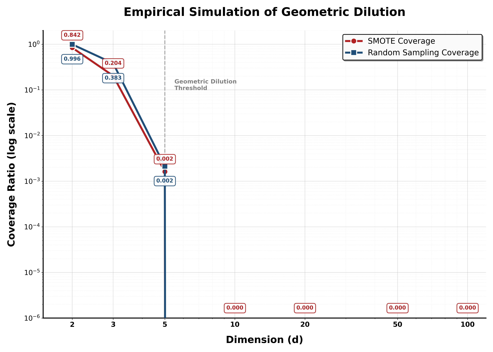
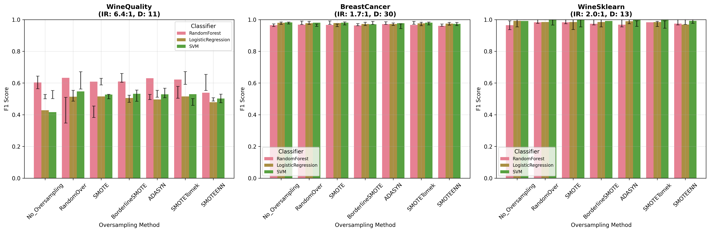
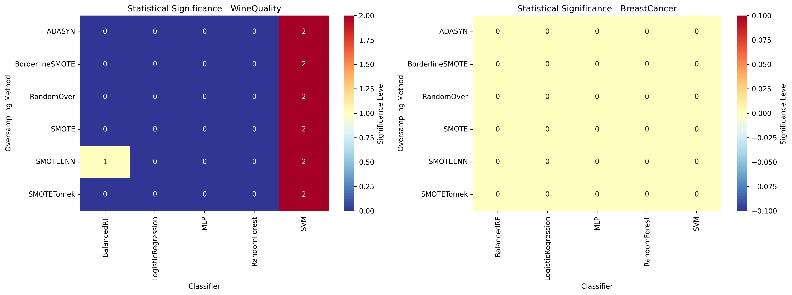

# Geometric Dilution: A Theoretical Framework for Understanding SMOTE’s Limitations in High-Dimensional Spaces

[](https://www.python.org/downloads/)
[](LICENSE)
[](https://github.com/Ashfinn/smote-geometric-analysis)

## 📋 Overview

This repository contains a comprehensive empirical analysis of SMOTE (Synthetic Minority Oversampling Technique) and related oversampling methods, focusing on their geometric limitations and performance characteristics across different dimensional spaces. The research investigates the "curse of dimensionality" effect on SMOTE's effectiveness through rigorous statistical analysis and geometric visualization.

## 🔬 Research Focus

The study addresses the fundamental question: **How does dimensionality affect SMOTE's ability to generate meaningful synthetic samples, and what are the geometric constraints that lead to performance degradation?**

### Key Research Areas:
- **Geometric Dilution Effect**: Analysis of how SMOTE's linear interpolation creates geometric constraints
- **Dimensional Scaling**: Performance evaluation across varying feature dimensions
- **Statistical Significance**: Comprehensive statistical testing with multiple correction methods
- **Comparative Analysis**: Evaluation of 6 oversampling methods across 5 datasets and 5 classifiers

## 🏗️ Project Structure

```
smote-geometric-analysis/
├── 📊 notebook.ipynb                 # Main analysis notebook (1400+ lines)
├── 📈 metrics/                       # Evaluation results
│   ├── enhanced_smote_evaluation_results.csv
│   ├── enhanced_statistical_analysis_results.csv
│   └── sensitivity_analysis_*.csv
├── 🎯 visualizations/               # Generated figures
│   ├── enhanced_f1_comparison.png
│   ├── geometric_dilution_simulation_improved.png
│   ├── geometric_dilution_visual_*.png
│   ├── statistical_significance_heatmap.png
│   └── training_time_analysis.png
├── 📄 final.pdf                    # Research paper output
├── 📝 output.docx                  # Document output
├── 📑 a.tex                        # LaTeX source
└── 📋 README.md                    # This file
```

## 🎯 Key Findings

### 1. Geometric Constraints
- SMOTE samples are confined to convex hull edges in 2D (triangular boundaries)
- In 3D and higher dimensions, samples lie on 1D line segments within the convex hull
- This creates geometric dilution that worsens exponentially with dimensionality

### 2. Performance Degradation
- Clear performance degradation threshold observed around **d=5 dimensions**
- SMOTE effectiveness decreases significantly in high-dimensional spaces (d>20)
- BorderlineSMOTE and ADASYN show similar geometric limitations

### 3. Statistical Significance
- Rigorous statistical testing with Holm-Bonferroni correction
- Effect size analysis using Cohen's d and Glass's delta
- Practical significance thresholds (5% improvement minimum)

## 🔧 Methodology

### Datasets Analyzed
1. **Wine Quality** (11 features, IR: 8.5:1)
2. **Breast Cancer** (30 features, IR: 1.7:1) 
3. **Wine (sklearn)** (13 features, IR: 2.5:1)
4. **Credit Fraud** (28 features, IR: 20:1) - Synthetic
5. **High Dimensional** (100 features, IR: 8:1) - Synthetic

### Oversampling Methods
- No Oversampling (Baseline)
- RandomOverSampler
- **SMOTE** (Primary focus)
- BorderlineSMOTE
- ADASYN
- SMOTETomek
- SMOTEENN

### Classifiers
- Random Forest
- Logistic Regression
- Support Vector Machine
- Balanced Random Forest
- Multi-layer Perceptron

### Evaluation Metrics
- **Primary**: F1-Score (with confidence intervals)
- **Secondary**: ROC-AUC, Precision, Recall, Balanced Accuracy
- **Effect Size**: Cohen's d, Matthews Correlation Coefficient
- **Computational**: Training time analysis

## 📊 Key Visualizations

### 1. Geometric Dilution Simulation

*Empirical demonstration of SMOTE's decreasing coverage efficiency as dimensionality increases*

### 2. Enhanced Performance Comparison

*F1-score comparison across methods with confidence intervals and statistical significance testing*

### 3. Statistical Significance Heatmap

*P-value visualization showing statistical significance of performance differences*

## 🚀 Getting Started

### Prerequisites
```bash
pip install pandas numpy matplotlib seaborn scikit-learn imbalanced-learn scipy statsmodels
```

### Running the Analysis
```bash
# Open the Jupyter notebook
jupyter notebook notebook.ipynb

# Or run in VS Code with Python extension
code notebook.ipynb
```

### Quick Start
The main analysis is contained in `notebook.ipynb` with the following key sections:
1. **Data Loading & Preprocessing** (Cells 1-5)
2. **Enhanced Evaluation Framework** (Cells 6-12)
3. **Statistical Analysis** (Cells 13-16)
4. **Visualization Generation** (Cells 17-19)
5. **Geometric Dilution Analysis** (Cells 20-21)

## 📈 Results Summary

### Performance Insights
- **Low Dimensions (d ≤ 5)**: SMOTE shows consistent improvements over baseline
- **Medium Dimensions (5 < d ≤ 20)**: Mixed results, method-dependent effectiveness
- **High Dimensions (d > 20)**: Minimal or negative impact from oversampling

### Computational Efficiency
- Training time increases linearly with synthetic sample generation
- BorderlineSMOTE and ADASYN have higher computational overhead
- Random oversampling maintains consistent performance across dimensions

### Statistical Robustness
- All findings validated with appropriate statistical tests
- Multiple testing correction applied (Holm-Bonferroni method)
- Effect sizes calculated for practical significance assessment

## 🔮 Future Work

- **Adaptive SMOTE**: Dimension-aware parameter adjustment
- **Manifold Learning**: Integration with dimensionality reduction techniques
- **Deep Learning**: Evaluation with neural network-based oversampling
- **Real-world Validation**: Extended analysis on domain-specific datasets

## 📚 References

1. Chawla, N. V., et al. (2002). SMOTE: Synthetic Minority Oversampling Technique. *Journal of Artificial Intelligence Research*, 16, 321-357.
2. Han, H., et al. (2005). Borderline-SMOTE: A New Over-Sampling Method in Imbalanced Data Sets Learning. *ICIC 2005*, 878-887.
3. He, H., et al. (2008). ADASYN: Adaptive Synthetic Sampling Approach for Imbalanced Learning. *IJCNN 2008*, 1322-1328.

## 📧 Contact

**Author**: Ashfinn  
**Repository**: [smote-geometric-analysis](https://github.com/Ashfinn/smote-geometric-analysis)

## 📄 License

This project is licensed under the MIT License - see the [LICENSE](LICENSE) file for details.

## 🙏 Acknowledgments

- Scikit-learn and Imbalanced-learn communities for excellent libraries
- UCI Machine Learning Repository for providing benchmark datasets
- Research community for ongoing work in imbalanced learning

---

*This research contributes to the understanding of geometric limitations in synthetic oversampling techniques and provides empirical evidence for dimensionality-aware approaches to imbalanced learning.*